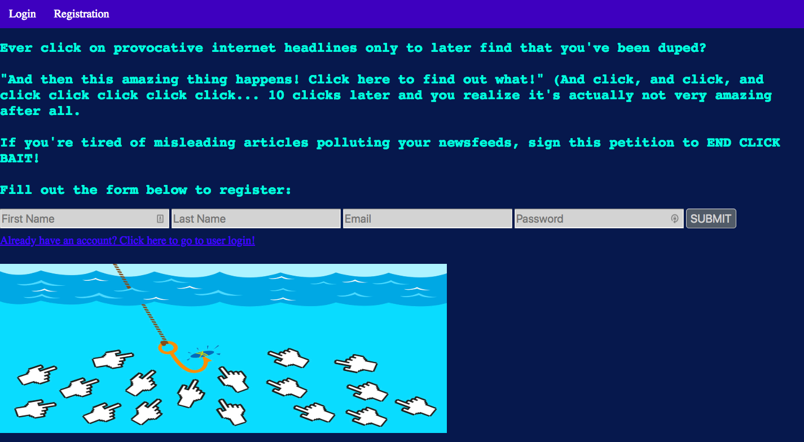
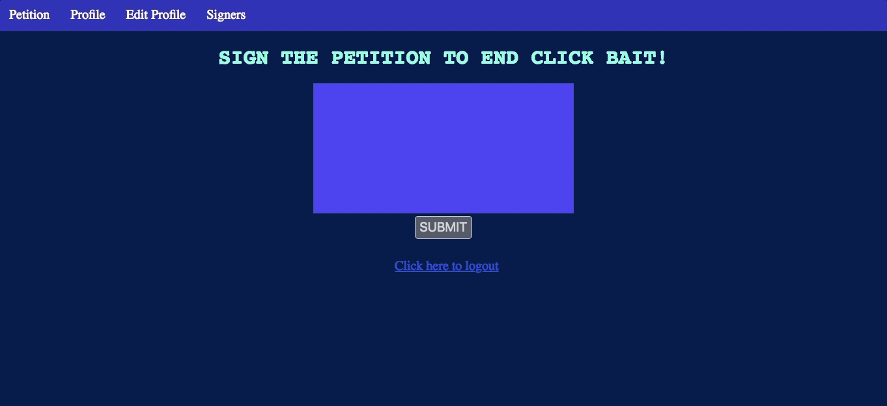

This is a petition against Click Bait! Everyone knows what it's like to be fooled into sacrificing precious clicks for saucy headlines that actually just lead to garbage articles. In an attempt to end this manipulative web tactic, I built this petition as a multi-page web application using JavaScript with Node.js, Express, Handlebars, PostgreSQL, FlexBox, HTML, and CSS. It can also be viewed on Heroku at https://lorettas-petition.herokuapp.com/registration.

Landing page:

Adding/editing your account profile:

Virtual signature:

